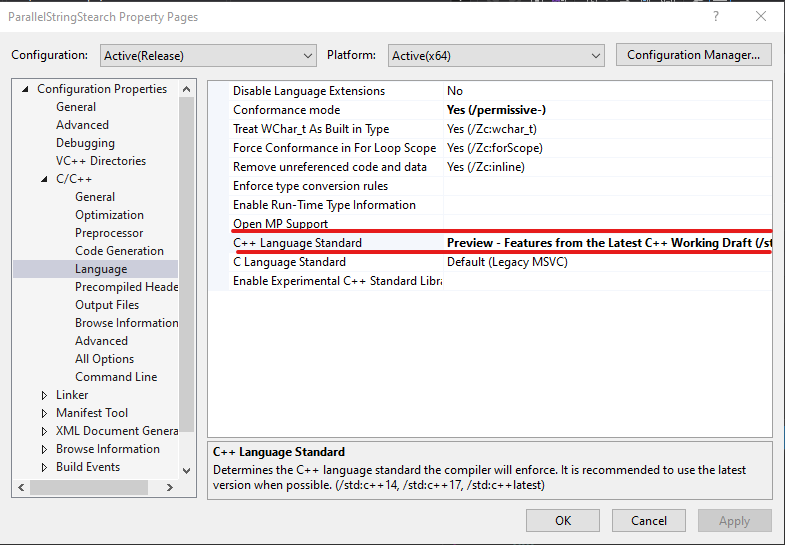

CMP 202 Coursework - Parallel String Search
===========================================

```
Author - Joseph Lee
Student Number - 1903399
Date - 10/05/2021
```

Summary
-------
This program uses the Boyer-Moore-Horspool algorithm to search for a list of string patterns in a search text. 

Notes On Directories
--------------------
There are 3 required directories within the application directory. These are:
* `PatternLists` - This should contain the search pattern list .txt file.
* `SearchTextx` - This should contain the seach text .txt file.
* `Results` - This directory is used to store the .csv timing results.

Notes On Compilation
--------------------
This application takes advantage of the std::barrier avaliable in C++20. This requires the solution C++ Language Standard to be set use the **Preview - Features from the Latest CPP Working Draft.**. Shown below. This is accessed by right-clicking the colution and navigating to the drop down in C/C++ => Language => C++ Language Standard.



